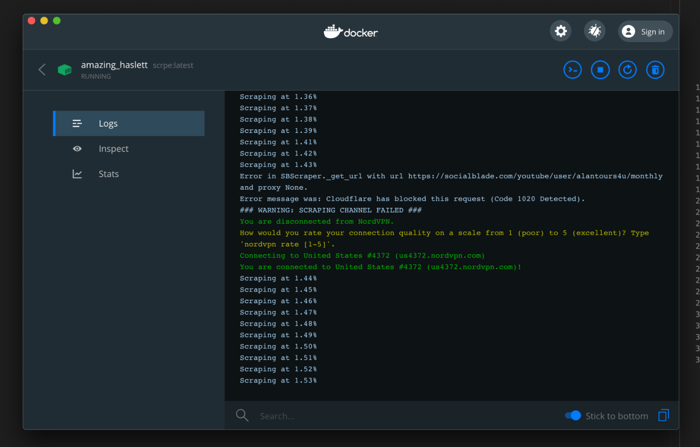

# README for the Socialblade Dataset

## Data origin
The data for this data set was scraped from [Socialblade](https://socialblade.com/), a website that tracks daily, 
monthly and weekly activity of the most influential channels on several big social media platforms such as YouTube, 
Twitter, Instagram, Facebook etc. We analyzed the available data for all categories and found that only YouTube and Twitter data was sufficiently
well tracked to be of any use. Due to time constraints, we focused on YouTube first. In case we find the time during the
preprocessing phase, we might add the twitter data later.  

Since there are no official stats for YouTube's traffic, we want to use the weekly/monthly view counts as a traffic indicator.
YouTube or Socialblade do not offer such a view count. Instead, Socialblade offers the statistics for the top 250 subscribed channels 
per country. Combined with more than 240 country categories available, we can track the data for > 50.000 very influential channels.  

There are several problems with this. First of all, the top channels right now do not have to include channels that were successful 
in 2018 for example. Also, if traffic was to mainly increase on mostly unknown channels we would have no chance of tracking it. 
Also, the data obtained from the website is heavily biased. In 2018, there are about 30.000 tracked channels in the main categories, 
whereas in 2020 we track more than 50.000. It remains to be seen if we can balance this during preprocessing.

> **_NOTE:_**  Dataset is divided into the data categories available on Socialblade. Each category is saved as an individual
>pandas data frame in the [processed folder](./processed).
>
## Code for scraping
There were multiple problems with obtaining the data. Since Socialblade is protected against DDoS attacks and bots by [Cloudflare](https://www.cloudflare.com/), 
we wrote a custom scraper to get the data.The scraping happens in three steps:
1. Get all countries available on Socialblade.
2. For each country, get the list of the top 250 subscribed channels.
3. For each of these > 50.000 channels, scrape all available data from the stats page.  

The two main issues were:
- Bypass the Cloudflare bot challenge request.
- Bypass the Cloudflare IP block after issuing too many requests.

We solved the Cloudflare bot challenge with the [cloudscraper](https://pypi.org/project/cloudscraper/) module, a module that can respond to the Javascript request from
Cloudflare to imitate a real browser. We then wrote a scraper that wraps around the Cloudscraper module to process the data from the websites HTML code. 
This was a little more complex than we initially anticipated. The data is saved inside Javascripts and not accessible via HTML tags. 
The scraper takes care of these problems.

IP blocking was an even bigger issue. In order to prevent this, we connect to a VPN account and change our server as soon as Cloudflare starts 
blocking our requests. Even then it takes a huge amount of time to scrape all channels. We addressed this by dividing the list of links 
into smaller work packages, dockerized the scraping process and are able to scrape with up to 6 VPN connections (maximum number of simultaneous connections for our VPN account).

The final workflow was as follows:
- Scrape the available countries, scrape their top lists and save the links into work packages by running [work_packages_creator.py](../../src/data_collection/social_scraper_lite/work_packages_creator.py).
- Start containers for the work packages with [start_containers.py](../../src/data_collection/social_scraper_lite/start_containers.py)

The complete code can be found in [social_scraper_lite](../../src/data_collection/social_scraper_lite), all Docker related files are located in the
[Docker subfolder](../../src/data_collection/social_scraper_lite/docker). Please note that the duplicate files in Docker are intentional to be able to load them into the containers.

In a nutshell, the crawler sends requests until Cloudflare blocks the IP address used. It then switches over to another VPN server, leaving Cloudflare clueless of prior activity.

## Code for preprocessing

Preprocessing was done by reading the raw data, resampling into consistent time intervals and dropping false values such as 
negative view counts. The source code for preprocessing is located in the [socialblade_processing.py](../../src/data_management/socialblade_processing.py) file.